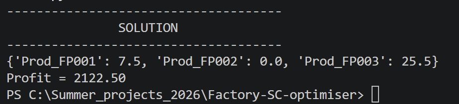

# Factory Supply Chain Optimiser

Code reads CSV files with data on products, material stock and bill of materials (BOM). Relevant coefficients are extracted from these, in order to formulate a continuous linear programming problem in PuLP and is subsequently solved for the optimal production plan of each product to maximise profit.

# Getting started

## Prerequisites

- Python
- Pandas
- PuLP

## Installation

Download all files from this repository.

## Executing program

Run the program SC-optimiser.py straight away once installation instructions have been followed. The output should read...

User is then free to replace csv files within Databases with their own. It is recommended to keep to the format of the files provided.

# Authors

Joseph Egan, joseph.egan22@icloud.com

# Liscence

This project is licensed under the MIT License - see the LICENSE.md file for details